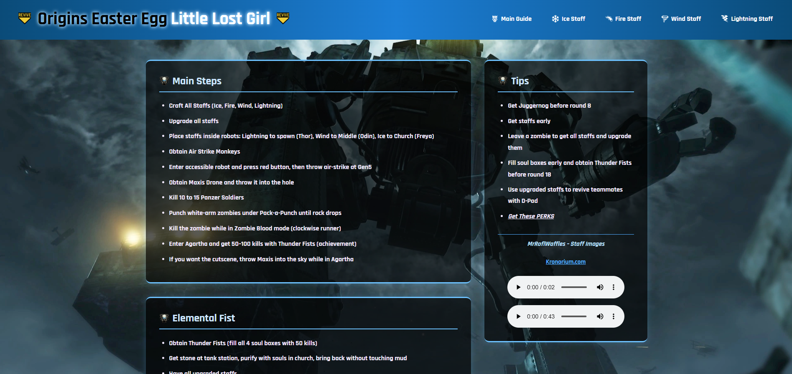

# Origins Easter Egg Guide

👻 Welcome to the **Origins EE Guide** — a fully immersive walkthrough for one of the most iconic Zombies maps in Call of Duty: Black Ops III.

## 🌐 Live Demo

Check out the live site here:  
[Origins Easter Egg Guide on Render](https://origins-wtyd.onrender.com)

## 📸 Screenshot

## 🔍 What’s Inside

- 🔹 **Complete Main Quest** – Follow the full *Little Lost Girl* Easter Egg, step by step.  
- 🔹 **Elemental Staff Guides** – Build and upgrade the **Fire**, **Ice**, **Wind**, and **Lightning** staffs.  
- 🔹 **Clean UI + Themed Layout** – Fully styled with glowing effects, responsive navigation, and lore-friendly design.  
- 🔹 **Mobile Friendly** – Optimized for all screen sizes, including phones.  
- 🔹 **Revive Icon Nav System** – Consistent Origins-themed navigation with skull icons and custom React icons.  

## 🛠️ Tech Stack

- **React + React Router**  
- **Custom CSS (no frameworks)**  
- **Responsive Design**  
- **React Icons**
